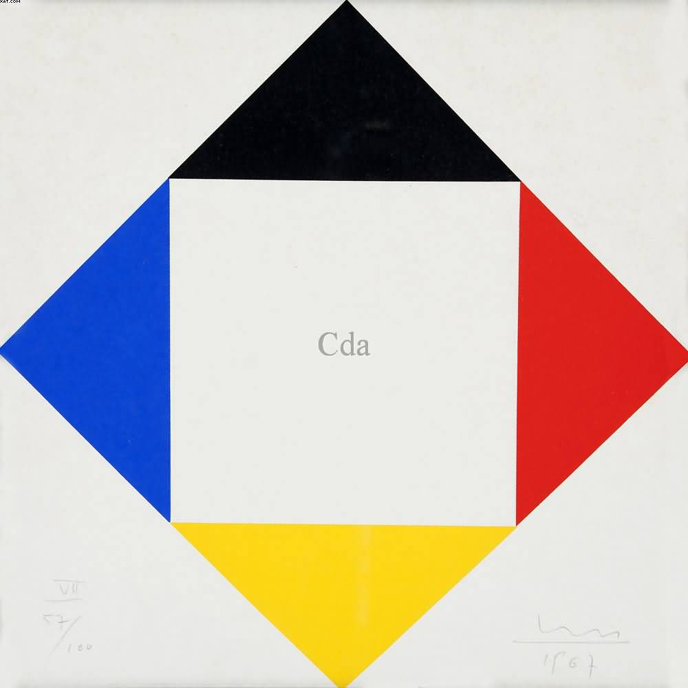

Sem Título. Max Bill, 24/10/2017

A composição foi recriada em p5.js com formas geométricas simples, mantendo a estrutura visual da imagem original. A interação principal ocorre por meio do clique do mouse sobre os triângulos da figura.
O triângulo superior, originalmente preto, possui uma interação especial: ao ser clicado, ele muda para uma cor aleatória do espectro RGB, gerada com a função random() do p5.js. Ao clicar novamente nesse mesmo triângulo, ele retorna para a cor preta. Caso seja clicado mais uma vez, uma nova cor aleatória é gerada, criando uma alternância simples entre preto e cor RGB aleatória.
Os demais triângulos mantêm uma interação mais simples: ao serem clicados, mudam para preto; ao receberem um novo clique, retornam para sua cor original. Dessa forma, a obra ganha uma camada interativa básica, permitindo que o usuário modifique visualmente a composição sem alterar sua estrutura geométrica principal.
A detecção do clique é feita verificando se a posição do mouse está dentro da área de cada triângulo. Para isso, o código usa uma função simples baseada no cálculo da área dos triângulos, permitindo identificar com precisão qual forma foi clicada.